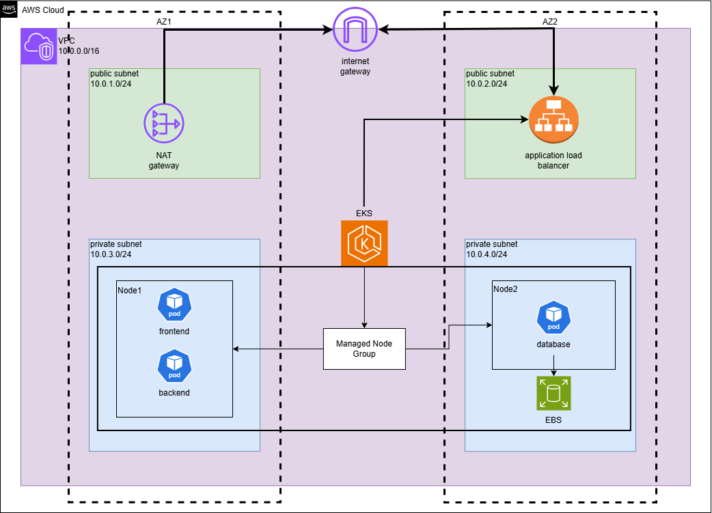

# Microservices Orchestration with Amazon EKS + Helm

> Microservices demo application (Frontend, Backend, Database) deployed on **Amazon EKS** using **Terraform** and **Helm**, built as a reference blueprint for Smartovate Ltd's client Cloud deployments.

This repository contains the application source code, the AWS infrastructure (Terraform), and the Kubernetes deployment configuration (Helm) for **Prescripto**, deployed on **AWS EKS**.

---

## Table of Contents

- [Architecture Overview](#architecture-overview)
- [Repository Structure](#repository-structure)
- [Prerequisites](#prerequisites)
- [Deployment Guide](#deployment-guide)
  - [1. Infrastructure (Terraform)](#1-infrastructure-terraform)
  - [2. Cluster Add-ons (ALB Controller, EBS CSI, Metrics Server)](#2-cluster-add-ons-alb-controller-ebs-csi-metrics-server)
  - [3. Application (Helm)](#3-application-helm)
- [Configuration / Environment Variables](#configuration--environment-variables)
- [Verifying the Deployment](#verifying-the-deployment)
- [Troubleshooting](#troubleshooting)
- [Rollback / Cleanup](#rollback--cleanup)
- [Maintainers](#maintainers)

---

## Architecture Overview

The diagram below illustrates the overall AWS/EKS architecture used to deploy **Prescripto**.



<!--
Place your architecture diagram image inside a `docs/` folder at the root of the repo,
and update the path above if needed (e.g., docs/architecture.png).
-->

**Summary of the flow:**

1. **Terraform** provisions the core AWS infrastructure: a **VPC** with 2 public and 2 private subnets across 2 Availability Zones, a **NAT Gateway** for outbound internet access from private subnets, the required IAM roles (least-privilege), and the **EKS cluster** with a **Managed Node Group** (e.g., `t3.medium` instances) running in the private subnets.
2. Once the cluster is created, **kubectl** is configured locally (`aws eks update-kubeconfig`), and an **OIDC provider** is associated with the cluster to enable IAM Roles for Service Accounts (IRSA).
3. Cluster add-ons are installed via **Helm**:
   - **AWS Load Balancer Controller** (using IRSA) — provisions an **Application Load Balancer (ALB)** whenever an Ingress resource is created.
   - **Amazon EBS CSI Driver** (using IRSA) — enables dynamic provisioning of persistent EBS volumes via a default `StorageClass` (`ebs.csi.aws.com`), used by the database's `PersistentVolumeClaim`.
   - **Metrics Server** — collects CPU/memory metrics, enabling `kubectl top` and Horizontal Pod Autoscaling (HPA).
4. **Helm** deploys the **Prescripto** application onto the EKS cluster, in a dedicated namespace (`demo-app`), as three components — **Frontend**, **Backend**, and **Database** — each packaged as its own Helm chart with `Deployment`/`StatefulSet`, `Service`, `ConfigMap`, and `Secret` resources. The Frontend communicates with the Backend, which in turn communicates with the Database.
5. External traffic reaches the application through the **AWS Load Balancer Controller**, which provisions an **ALB** from the Ingress resource, exposing the Frontend to the internet.
6. The **Database** uses a `StatefulSet` with a `volumeClaimTemplate` backed by an **EBS volume**, ensuring data persists across pod restarts.

---

## Repository Structure

```
.
├── app/                # Application source code 
├── terraform/           # Infrastructure as Code 
│   ├── captures/         # screenshots of the project
│   └── main.tf
├── helm/                # Helm charts for the application and cluster add-ons
│   ├── frontend/          # Helm chart for the Frontend microservice
│   ├── backend/           # Helm chart for the Backend microservice
│   ├── database/          # Helm chart for the Database (StatefulSet + PVC)
│   └── mongodb/           # Helm chart for the mongodb
└── README.md
```

| Folder | Purpose |
|---|---|
| `app/` | Contains the application source code (Frontend, Backend) and the `Dockerfile`(s) used to build the container images. |
| `terraform/` | Provisions the AWS infrastructure: VPC, public/private subnets, NAT Gateway, IAM roles, and the EKS cluster with its Managed Node Group. |
| `helm/` | Contains the Helm charts for the Frontend, Backend, and Database components, plus values files for the cluster add-ons (ALB Controller, EBS CSI Driver, Metrics Server). |

---

## Prerequisites

Make sure the following tools are installed and configured before deploying:

| Tool | Minimum Version | Purpose |
|---|---|---|
| [AWS CLI](https://docs.aws.amazon.com/cli/) | `2.36.14` | AWS authentication and resource access |
| [Terraform](https://developer.hashicorp.com/terraform) | `1.15.8` | Infrastructure provisioning |
| [kubectl](https://kubernetes.io/docs/tasks/tools/) | matching EKS cluster version | Interacting with the EKS cluster |
| [Helm](https://helm.sh/) | `v4.2.3` | Deploying add-ons and the application to Kubernetes |
| [Docker](https://www.docker.com/) | `28.5.2` | Building the application images (if applicable) |

**AWS Access:**
- An AWS account with permissions to create VPCs, EKS clusters, IAM roles (including OIDC/IRSA), and related resources.
- AWS credentials configured locally:
  ```bash
  aws configure --profile <profile-name>
  ```

---

## Deployment Guide

### 1. Infrastructure (Terraform)

```bash
cd terraform/

# Initialize Terraform and download providers/modules
terraform init

# validate the terraform code
terraform validate

# Review the execution plan
terraform plan 

# Apply the infrastructure changes
terraform apply 
```

This provisions:
- A **VPC** with 2 public and 2 private subnets across 2 AZs, correctly tagged for EKS auto-discovery:
  - Public subnets: `kubernetes.io/role/elb=1`
  - Private subnets: `kubernetes.io/role/internal-elb=1`
  - All subnets: `kubernetes.io/cluster/<cluster-name>=shared` (or `owned`)
- A **NAT Gateway** for private subnet internet access, with correctly configured route tables.
- The **EKS cluster** (control plane) and a **Managed Node Group** deployed in the private subnets.
- IAM roles for the cluster and the node group, following least-privilege.
- ALB controller.
- EBS configuration.

Once the cluster is created, update your local kubeconfig:

```bash
aws eks update-kubeconfig --name <cluster-name> --region <aws-region> --profile <profile-name>
```

Verify the connection:

```bash
kubectl get nodes
```


### 2. Application (Helm)
 
The application charts (`frontend`, `backend`, `database`) are installed/uninstalled together using the `helm-deploy.sh` script.
 
```bash
cd helm/
 
# Install (or upgrade) all charts
./helm-deploy.sh install
 
# Uninstall all charts
./helm-deploy.sh uninstall
```
 
The script loops over every subfolder in `helm/` and runs `helm upgrade --install <chart_name> <chart_path> --wait` for install, or `helm uninstall <chart_name> --namespace <chart_name> --ignore-not-found` for uninstall.
 
> **Note:** `uninstall` targets a namespace matching each chart's folder name (e.g. `frontend`, `backend`, `database`). Make sure each chart is installed into a namespace of the same name as its folder, or adjust the script/namespaces to stay consistent.
 
**Key values to review/override in each `values.yaml`:**
 
| Key | Description | Applies to |
|---|---|---|
| `image.repository` / `image.tag` | Container image location and version | frontend, backend |
| `replicaCount` | Number of pod replicas | frontend, backend |
| `resources.requests` / `resources.limits` | CPU/memory requests and limits | all |
| `env` | Application environment variables | frontend, backend |
| `ingress.enabled` / `ingress.className` | Enable Ingress and set ALB annotations | frontend |
| `persistence.storageClassName` / `persistence.size` | EBS-backed volume for the database `StatefulSet` | database |

## Configuration / Environment Variables

The application relies on the following configuration, injected via Kubernetes Secrets/ConfigMaps:

| Variable | Description | Source |
|---|---|---|
| `<DB_HOST>` / `<DB_USER>` / `<DB_PASSWORD>` | Database connection details used by the Backend | K8s Secret |
| `<BACKEND_URL>` | Backend API endpoint used by the Frontend | K8s ConfigMap |
| `<APP_ENV>` | Deployment environment (dev/staging/prod) | K8s ConfigMap |

> Never commit secrets or `.tfvars` files containing sensitive values to the repository.

---

## Verifying the Deployment

Check that the pods, services, and ingress are running correctly:

```bash
kubectl get pods 
kubectl get svc 
kubectl get ingress 
```

Confirm HPA is reacting to load (Backend):

```bash
kubectl get hpa 
```

Access the application via the ALB URL created by the Ingress:

```bash
kubectl get ingress frontend -o jsonpath='{.status.loadBalancer.ingress[0].hostname}'
```

Open the returned hostname in a browser.

---

## Troubleshooting

Common issues anticipated and encountered during infrastructure provisioning and application deployment.

| Problem | Possible Cause | Fix |
|---|---|---|
| **ALB is not created by the Ingress Controller** — `aws-load-balancer-controller` pod logs show `AccessDenied` or fails to discover subnets | The ServiceAccount is not correctly annotated with the IAM role ARN (IRSA), the IAM policy is missing ELB permissions, or subnets are missing the required tags | 1) Verify the ServiceAccount is annotated with the correct IAM role ARN. 2) Check the IAM policy attached to the role includes Elastic Load Balancer permissions. 3) Ensure public subnets have `kubernetes.io/role/elb=1` and private subnets have `kubernetes.io/role/internal-elb=1` for auto-discovery |
| **Pods stuck in `Pending`** — `kubectl describe pod` shows `0/X nodes are available: Insufficient cpu/memory` | Resource `requests`/`limits` in the Helm chart's `values.yaml` are too high for the available node capacity | 1) Review and adjust `requests`/`limits` in `values.yaml` to more realistic values for the environment. 2) If the cluster genuinely lacks capacity, increase the instance type or desired capacity of the Managed Node Group via Terraform and re-apply |
| **Database loses data after pod restart**, or the pod fails to start with a volume mount error | The database chart uses a `Deployment` instead of a `StatefulSet`, no `volumeClaimTemplates` is defined, or the EBS CSI driver isn't functioning correctly | 1) Ensure the database Helm chart uses a `StatefulSet`, not a `Deployment`. 2) Confirm a `volumeClaimTemplates` is defined to request a `PersistentVolume` via the EBS `StorageClass`. 3) Verify the EBS CSI driver is installed and running by checking the logs of the `ebs-csi-node` DaemonSet pods |
| `terraform apply` fails during EKS creation | Insufficient IAM permissions | Ensure the IAM user/role has `eks:CreateCluster` and related EC2/VPC permissions |
| `kubectl` cannot connect to the cluster | kubeconfig not updated / expired credentials | Re-run `aws eks update-kubeconfig ...`; check `aws sts get-caller-identity` |
| `helm upgrade` fails | Invalid values or chart syntax error | Run `helm lint ./<chart-folder>` and validate `values.yaml` |

---

## Rollback / Cleanup
 
**Roll back a single Helm release:**
```bash
helm rollback <release-name> <revision-number> -n <namespace>
```
 
**Uninstall the application (all charts):**
```bash
cd helm/
./helm-deploy.sh uninstall
```
This runs `helm uninstall <chart_name> --namespace <chart_name> --ignore-not-found` for each chart — i.e. it expects each release to live in a namespace named after its chart folder (`frontend`, `backend`, `database`). If you installed into a different namespace, uninstall manually with `helm uninstall <release> -n <namespace>` instead.
 
**Destroy the infrastructure (use with caution):**
```bash
cd terraform/
terraform destroy 
```
 
---

## Maintainers

| Name | Role | Contact |
|---|---|---|
| `Mohamed Ouhichi` | Stagiaire / DevOps Intern, Smartovate Ltd | `www.linkedin.com/in/mohamed-ouhichi-281227337` |

